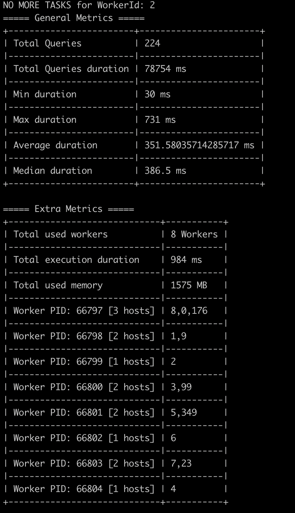
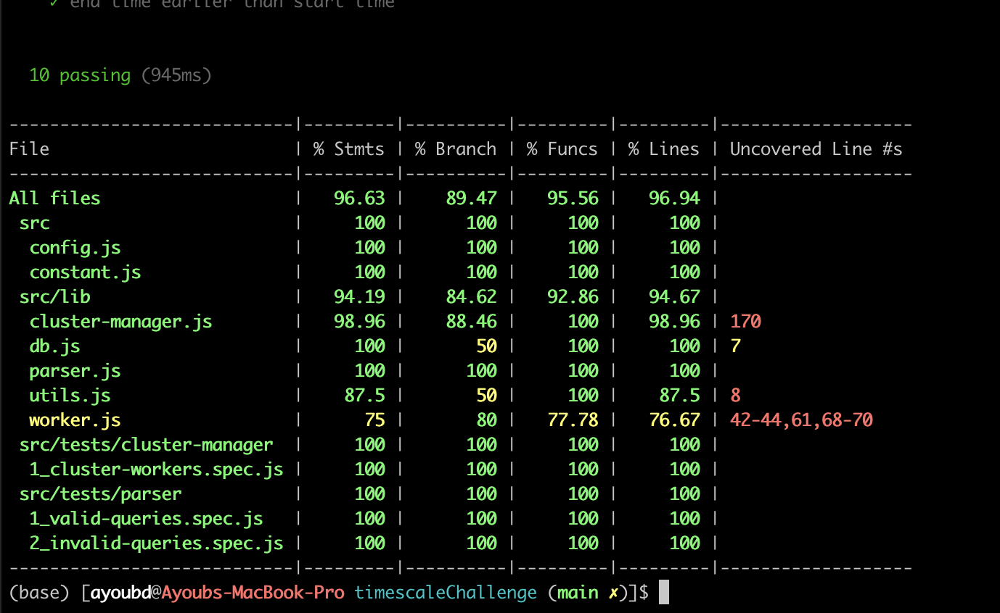

# Timescale Challenge

# Introduction

This challenge consists of building a tool that will help the team to run batches of queries and also to benchmark their performance.

The tool has been written with `Node.JS`.



## Workflow

You can find further details about the workflow and how the workers are managed in [WORKFLOW.md](WORKFLOW.md) file.

## Notes:

`eslint` has been used as a linter for the project.

`eslint-airbnb` has been selected to maintain the coding style of the project across the members of the team. `airbnb` coding style is being used across different organizations and could be considered as the industry standard.

### Installation:

By default, you need to have `npm` and `nodejs` already installed.

In order to run the code locally, you should run those commands:

Install dependencies: `npm install`

Run the application: `npm start`

You can run the script directly using this command:
`node ./src/main.js`

You can also specify the input file with `--file` flag:

`node src/main.js --file=./src/data/query_params.csv`

#### For development purposes:

```bash
# ESLint (JS linter)
npm i eslint -g

# Mocha (testing framework)
npm i mocha -g

# Test coverage tool
npm i nyc -g
```

To check if there are any vulnerabilities in the packages, use this command:

```bash
npm audit
```

### Configuration:

By default, the application supports some configurations that could be sent via the environment variables (security measure).

Available variables:

```
PGSQL_USERNAME (default: 'postgres')
PGSQL_PASSWORD (default: 'password')
PGSQL_HOST (default: 'localhost')
PGSQL_PORT (default: '5432')
PGSQL_DATABASE (default: 'homework')
MAX_CONCURRENT_WORKERS (default: [MAX_CPU])
```

### Testing:

In order to be able to do testing, just run the command: `npm run docker-compose-test`

You can check an example of the test coverage on:



## Docker (Optional)

In order to build a docker image of the project, you can just run this command:

`npm run build-docker`

### Manual run:

##### TimescaleDB
```
export TIMESCALE_CONTAINER_NAME=timescaledb-instance

docker run -d --name ${TIMESCALE_CONTAINER_NAME} -v $(pwd)/src/data:/data -p 5432:5432 -e POSTGRES_PASSWORD=password timescale/timescaledb:latest-pg12

# Intialization
sleep 10
docker exec -ti ${TIMESCALE_CONTAINER_NAME} bash -c 'psql -U postgres < /data/cpu_usage.sql'
docker exec -ti ${TIMESCALE_CONTAINER_NAME} bash -c 'psql -U postgres < /data/cpu_import.sql'
```

##### Tool

If you have docker installed on your host machine, you can use the DNS entry `host.docker.internal` that points to the host machine.
(Tested on MacOS 10.15.3 with Docker 19.03.8)

```
export TIMESCALE_APP_CONTAINER_NAME=timescaledb-app-1
docker run -d --name ${TIMESCALE_APP_CONTAINER_NAME} -v $(pwd)/src/data:/app/data -e PGSQL_HOST=host.docker.internal timescale-app:latest
docker logs ${TIMESCALE_APP_CONTAINER_NAME}
```

### Docker Compose:

Instead of managing different dependencies separately, I used `docker-compose` with `timescale` docker image to provision the database:
`npm run docker-compose`

`docker-compose --env-file ./.env.docker-compose -f ./docker/docker-compose.yml up`

