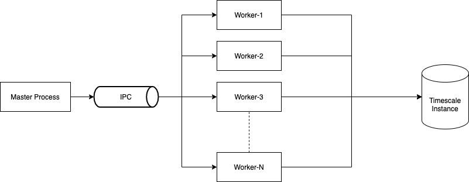
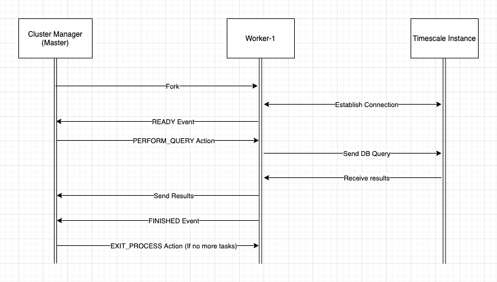

# Introduction

This section concerns the detailed explanation of the work flow about how the workers flow is managed.

## Concurrency Model

The language that has been used is NodeJS, and due to its asynchronous nature, I decided to follow a multiprocessing approach instead of multithreading approach to maximize the performance of the tool since the type of task (query the database) isn't that CPU intensive, then each process will be able to handle asynchronously multiple queries.

NodeJS Documentation: https://nodejs.org/api/worker_threads.html

```
Workers (threads) are useful for performing CPU-intensive JavaScript operations. They will not help much with I/O-intensive work. Node.js’s built-in asynchronous I/O operations are more efficient than Workers can be.
```





## Used Library

I used `cluster` module because of the advantages it has by provisioning multiple processes and managing their workflow, the other approach would be to use `worker_threads` instead, but since there is no need to share the memory across those different workers to synchronize the work, and also the process isn't that CPU intensive (Only I/O operations), then implementing a process oriented concurrency model would make more sense.

Plus the fact of the library `worker_threads` doesn't include some advanced methods and functions to handle and orchestrate the communication across these different workers, I followed up by using `cluster` module instead.


##### Note:

The database connection has been implemented using the 'Client' instead of 'Pool'.

In a production environment, pooling is preferred for the better performance, but I kept using Client in order to test and distinguish the performance with different workers.

Using pooling, you won't see the impact of concurrent workers.